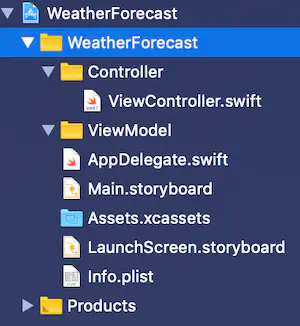

## 简介

创建 App 时有许多不同的架构可以选择，其中使用最为广泛的是 MVC (*Model-View-Controller*)，虽然现在 MVC 由于缺少一些结构层面的抽象，经常被戏称为 Messive View Controller (*Messive - 笨重的*)。这篇文章我们就来研究一下如何在 iOS 应用中使用 [MVVM (Model-View-ViewModel)](https://en.wikipedia.org/wiki/Model–view–viewmodel) 这种设计模式。

MVVM 的使用让我们能够从 ViewController 中提取出一些页面显示逻辑，让我们能够为每个 View 分别自定义不同的 Model，即 ViewModel (*当然，如果有需要，我们仍然能复用这些 ViewModel* )。比如，我们从 API 获取一个字符串 "Hello World"，但在页面上希望它展示为 "Hello World, how are you?"，如果有这种需求，在每个 View 中对字符串进行修改没太大意义，这时候就需要请 ViewModel 入场了。


## 正文

### 1、设置文件目录结构

正确的工程文件目录结构对于使用 MVVM 来说很重要，正确的结构能够使我们的项目更易于维护。在基础文件夹 *WeatherForecast* 上呼出菜单（鼠标-单击右键，触控板-双指单击）：

1. 点击 New Group
2. 重命名文件夹为 ViewModel
3. 重复以上操作，创建名为 Controller 的文件夹
4. 将 ViewController.swift 拖入 Controller 文件夹




### 创建 ViewModel

ViewController 获取到一个 CurrentWeather 对象，结构如下：

```swift
struct CurrentWeather: Codable {
        let coord: Coord
        let weather: [WeatherDetails]
        let base: String
        let main: Main
        let visibility: Int
        let wind: Wind
        let clouds: Clouds
        let dt: Int
        let sys: Sys
        let id: Int
        let name: String
    }
```

除了 String 和 Int 这种基础类型的对象外，它还包括其他类型的对象，我们需要使用 ViewModel 解析出我们真正需要的信息。比如，这个 ViewController 可能只对风力（wind）、坐标（coord）和 名称（name） 信息感兴趣。

我们现在开始创建一个 ViewModel：

1. 在 ViewModel 文件夹上呼出菜单
2. 点击 New File
3. 选择 swift File，点击 Next
4. 命名为 WindViewModel

在新建的文件中添加以下代码：


```swift
// ViewModel/WindViewModel.swift

    import Foundation
    
    struct WindViewModel {

        let currentWeather: CurrentWeather

        init(currentWeather: CurrentWeather) {
            self.currentWeather = currentWeather
        }
    }
```


以上，我们新建了一个 ViewModel 并且自定义了 initializer，以便我们可以从 ViewController 传入 CurrentWeather 对象。这个 ViewModel 将对 CurrentWeather 对象中的数据进行操作，以便我们可以按照需求展示我们需要的信息。这种方式可以将一些逻辑方法从 ViewController 中剥离出来，为 ViewController 瘦身。

下面，我们要根据界面需求，为 ViewModel 增加一些属性。这里有一个原则，就是只增加界面中必要的属性：


```swift
    private(set) var coordString = ""
    private(set) var windSpeedString = ""
    private(set) var windDegString = ""
    private(set) var locationString = ""
```


注意 `private(set)`，它表示这个属性能够在此文件外进行读取，但只能在此文件中进行修改。下面我们将加入一些设置这些属性的方法，完成后这个文件会是这样的：

```swift
// ViewModel/WindViewModel.swift

import Foundation

struct WindViewModel {
    
    let currentWeather: CurrentWeather
    
    private(set) var coordString = ""
    private(set) var windSpeedString = ""
    private(set) var windDegString = ""
    private(set) var locationString = ""
    
    init(currentWeather: CurrentWeather) {
        self.currentWeather = currentWeather
    }
    
    private mutating func updateProperties() {
        coordString = setCoordString(currentWeather: currentWeather)
        windSpeedString = setWindSpeedString(currentWeather: currentWeather)
        windDegString = setWindDirectionString(currentWeather: currentWeather)
        locationString = setLocationString(currentWeather: currentWeather)
    }
    
}

extension WindViewModel {
    
    private func setCoordString(currentWeather: CurrentWeather) -> String {
        return "Lat: \(currentWeather.coord.latitude), Lon: \(currentWeather.coord.longtitude)"
    }
    
    private func setWindSpeedString(currentWeather: CurrentWeather) -> String {
        return "Wind Speed: \(currentWeather.wind.speed)"
    }
    
    private func setWindDirectionString(currentWeather: CurrentWeather) -> String {
        return "Wind Deg: \(currentWeather.wind.deg)"
    }
    
    private func setLocationString(currentWeather: CurrentWeather) -> String {
        return "Location: \(currentWeather.name)"
    }
    
}
```


1. 创建突变函数(mutating function)，让我们能够更改 Struct 内的属性。
2. 为每个属性创建不同的设置函数。

目前这些方法都非常简单，但随着学习的深入，它们可能会变得更加复杂，尤其是当我们在 CurrentWeather 对象中使用可选值（optional value）之后。假如我们使用 MVC 模式，而且必须在 ViewController 内的许多地方访问这些可选值，我们会看到 ViewController 的代码量大幅提升，而且会充满了 guard 声明。然而，MVVM 模式使得我们能够对每个可选值只使用一次 guard 声明，比如，如果 location 变量是可选的，我们只需要这么做：


```swift
private func setLocationString(currentWeather: CurrentWeather) -> String {

      guard let name = currentWeather.name else {
        return "Location not available"
      }
      
      return "Location: \(name)"
    }
```


这样我们就可以在 ViewController 中随意访问 `locationString` 变量，不必在对它是否为 nil 进行检验，因为我们在 ViewModel 中已经进行了检验。


### 2、设置和使用 ViewModel

至此，我们已经创建并实现了我们需要的 ViewModel，接下来就可以在 ViewController.swift 中使用它了。

在 ViewController.swift 类 `private let apiManager = APIManager()` 之下写入以下代码：


```swift
    private(set) var windViewModel: WindViewModel?
    
    var searchResult: CurrentWeather? {
        didSet {
                guard let searchResult = searchResult else { return }
                windViewModel = WindViewModel.init(currentWeather: searchResult)
        }
    }
```


这样就实例化了一个只允许在 ViewController 中进行修改的 WindViewModel 对象，还实例化了一个带有 didset 属性观察器的 CurrentWeather 对象，名为 searchResult。didset 属性观察器意味着当其对应的对象被设置或改变后，观察器中的方法就会运行。在我们的示例中，这个观察器会实例化一个临时的 CurrentWeather 对象，用来存储上面的 self.searchResult 实例，它也叫 searchResult，然后初始化一个 WindViewModel 实例，在初始化方法中将临时的 searchResult 实例传入。现在，我们需要做的就是在请求 API 成功的回调方法中对 self.searchResult 进行赋值。

在 ViewController 的 extension 中实现 getWeather() 方法：


```swift
    private func getWeather() {
        apiManager.getWeather() { (weather, error) in
            if let error: Error = error {
                print("Get weather error: \(error.localizedDescription)")
                return
            }
            
            guard let weather = weather  else { return }
            self.searchResult = weather
        }
    }
```


我们对 self.searchResult 进行了赋值，下面将实现简单的 UI 界面，用来展示我们期望的天气信息：

- 在 main.storyboard 的 ViewController 中拖入四个 UILabel，做好约束。
- 实现以下四个 IBOutlet，与 storyboard 中的四个 label 进行连接：


```swift
    @IBOutlet weak var locationLabel: UILabel!
    @IBOutlet weak var windSpeedLabel: UILabel!
    @IBOutlet weak var windDirectionLabel: UILabel!
    @IBOutlet weak var coordLabel: UILabel!
```


然后，在 ViewController 的 extension 中实现 updateLabels() 方法：

```swift
private func updateLabels() {
        guard let windViewModel = windViewModel else { return }
        
        locationLabel.text = windViewModel.locationString
        windSpeedLabel.text = windViewModel.windSpeedString + " m/s"
        windDirectionLabel.text = windViewModel.windDegString
        coordLabel.text = windViewModel.coordString
    }
```


注意，我们的 windViewModel 实例是可选类型，因此我们需要保证在访问其属性时它已经被赋值，而不是 nil。这也是为什么我们在 self.searchResult 中对临时 searchResult 进行赋值时使用 guard 语句的原因。初始化一个非 nil 的 windModel 后，在主线程中对 UI 进行更新，self.searchResult 的 didset 属性观察器会变成这样：


```swift
var searchResult: CurrentWeather? {
        didSet {
            guard let searchResult = searchResult else { return }
            windViewModel = WindViewModel.init(currentWeather: searchResult)
            DispatchQueue.main.async {
                self.updateLabels()
            }
        }
    }
```


这时候，我们就可以运行这个 App 了，它会自动请求网络，如果成功，四条天气信息将会展示在四个 label 上。